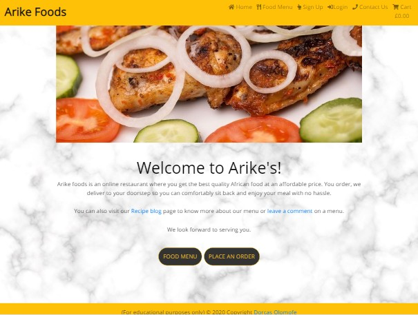

# Welcome to Arike Foods!

## [Visit Site](https://ms4-project-arikefoods.herokuapp.com/)

## Table of Contents
1. [Project Description](#description)
2. [User Experience & Design](#ux)
3. [Features](#features)
4. [Technologies Used](#technologies-used)
6. [Testing](#testing)
7. [Bugs](#bugs)
7. [Deployment](#deployment)
8. [Credits & References](#credits-&-references)

## Project Description
The idea of creating this project was born from my desire to start an online restaurant business and influenced by a few recipe and restaurant sites I had visited. I have an in-born passion for good cooking and I enjoy seeing people being served with excellence in that regard. 

The idea of this online restaurant is help reduce the burden of many who do not enjoy cooking or who many not have the time to do their own cooking due to many other commitments. As we know, everyone needs to eat and having access to good food without lift a pot would be a great advantage to many. Also, due to the present situation in the world, we see many turning to online shopping which is making many high street restaurant businesses reduntant at present. 

I believe strongly in this idea and I look forward to what it will become in the near future.

Thank you and enjoy the ride. :rocket:

## UX

This project was created to meet the needs of a vast majority of people. Below are a some _User Stories_:

* As a potential user and customer on visiting your site, I want to be able to do the following:
  + 'Register easily.'
  + 'Once registered to receive and email confirmation.'
  + 'Easily login and logout as desired.'
  + 'View a list of available meal for purchase.'
  + 'Have access to the price list of items.'
  + 'Easily select one or more items for purchase.'
  + 'Be able to control or edit the quantity of item I'd like to purchase.'
  + 'Leave a review on a meal wherever possible.'
  + 'View items in my shopping bag.'
  + 'Get a feedback on actions as I perform them.'
  

## Features
1. **Home Page:** This contains the following:
  + The Navbar which displays the Logo (links to the homepage on click), the "Home", "Food Menu", "Sign Up", "My Account", and "Cart" links.
  + The Carousel (Image Slider).
  + The Welcome message (includes links to the Recipe blog and Feedback pages).
  + The Navigation button to access Food Menu and Menu Order pages.
  + The Footer which displays the copyright content.
2. **The Food Menu Page:** This contains the following:
  + The menu table which displays the menu details (Name, Description, Category and Price).
3. **The Recipe_Blog Page:** This contains the following:

### Features to be Implemented
+ The User Profile page.
+ Enable user to update their profiles.
+ Add a subscription feature where users can have access to more benefits of being a member.
+ A link to the Cookbook site where users can have access to more Recipes and have the ability to add their own.

## Technologies Used
The following technologies were used to achieve the requirements of this project:

+ [Python](https://www.python.org/)
  + I used this as the backend language to help manipulate data.
+ [Heroku](https://www.heroku.com/)
  + This was used to host my website.
+ [Github](https://github.com/)
  + This was used as the project repository. 
+ [Gitpod](https://www.gitpod.io/) 
  + This was used to develop the site and [Git](https://git-scm.com/) for version control.
+ [CSS3](https://en.wikipedia.org/wiki/Cascading_Style_Sheets)
  + CSS3 was used to custom sytle my website to my desired outcome.
+ [HTML5](https://en.wikipedia.org/wiki/HTML5)
  + HTML5 was used as the markup language to structure and present my website on the Web.
+ [Javascript](https://www.javascript.com/)
  + This was used to achieve the interactive part of the site.
+ [JQuery](https://www.jquery.com/)
  + These scripts from the Materialize were used to initialise some features on my site.

  
## Testing
Over the course of building this project, I encountered a few challenging **bugs** which I was able to **fix** by asking relevant questions from the Tutors, my Mentor and carrying out extensive research. This made it paramount for me to adopt the *defensive* approach and habitually carry out testings as I build the site (I made use of the **developer tool**) so as to ensure things work properly, and in addition to this, I carried out the following:

+ **Responsiveness Testing**
1. During construction, I regularly test the site against its *Responsiveness* by clicking on **Inspect** to view the *developer tool*.
2. I then checked the layout by clicking on the **Ipad, the Iphone and selected other devices to view**.
3. I also adjusted the pane to view the point at which the design changes to a mobile, tablet, laptop or desktop view.

+ **Page Testing**
I carried out the following tests on these devices (Mobile, tablet, laptop):
   + Once the site loads, all contents were displayed as expected.
   + I clicked on all links in the Navigation and side bars which opens the required page successfully.
   + I clicked on all buttons which acted as expected.
   + All icons behave as expected.
   + All forms stored and displays data as expected.
   + Form input validations works as expected.
   + The dropdown options work correctly.
   + The submit button on click, stores the entered data in the database as expected.
   + The cancel and other navigation buttons take you to the expected pages.
   + The Carousel images scroll as expected.
   + The copyright displays correctly on all pages.

+ **UX Testing**
  + To validate the user experience, I asked a number of my friends and family members to help. They were asked to use the site so as to help give an unbias and accurate feedback.
 
   1. They were to try using all the links to test its functionality and usability.
 
   2. They all came back with different feedbacks as follows:
     + "Whao Whao, beautiful, a job well done!"
     + 
     
 + **Other Testings**
  + For my **HTML5 code testing**, I used [The W3C Markup Validation Service](https://validator.w3.org/)
  + For my **CSS3 code testing**, I used [The W3C CSS Validation Service - Jigsaw](https://jigsaw.w3.org/css-validator/)
  + For my **Javascript and JQuery code testing**, I used [JSHint](https://jshint.com/)
  + For my **Python code testing**, I used [PEP8](http://pep8online.com/)
  + For **Browsers testing**, I did not have any issues opening or viewing the site on the different browsers that was used namely: **Microsoft Edge**, **Mozilla Firefox**, **Google Chrome**, **Safari** and other different mobile browsers, namely, **Android** and **iOS.** On all of these platforms, I had a smooth user-friendly experience.

## Bugs

I encountered a number of bugs in the process which I was able to overcome the majority of them.

## Deployment

To deploy my site, I made use of the Heroku hosting platform following this process:

1. Created a new app in Heroku
2. In the settings tab, the following environment variables configuration were set in place:
  
  - SECRET_KEY = "My secret key"
  - 
3. From the heroku dashboard of my application, I clicked on "Deploy" > "Deployment method" and selected GitHub.
4. I connected to my GitHub repository.
5. I then set the project up for automatic deployment which helped to deploy easily whenever the master branch is updated through pushing to Github.
6. To do this manually, in the deployment section, select the master branch and click 'Deploy Branch".
7. The site should then be successfully deployed.
  
To run code **locally**:
1. From [GitHub](https://github.com/), click on the "Clone" button.
2. Choose "Download Zip" (The download starts).
3. After the download is complete, open the zip folder by double clicking to access created page.
4. The page will launch on your chosen browser.
NOTE: Ensure that you have ..... downloaded on your device else this will not work. Also, install the following:
  + `pip install -r requirements.txt`.
  + For any newly added packages to the project, use `pip freeze --local > requirements.txt ` this will update the requirements.txt file with new dependencies.
  + Also ensure that a Procfile is installed for it to run on Heroku.
  

## Credits & References
From my research, the following made an impact in the successful completion of this project as it had been extremely challenging yet enjoyable. I have also learnt a lot from completing the project. Please kindly see links below. Thank you.

### Content

+ **Tutorials and Other useful resources**
+ [Code Institute for HTML, CSS, JavaScript & UX](https://courses.codeinstitute.net/program/FullstackWebDeveloper)
+ [Challenger](https://github.com/maliahavlicek/ms4_challenger)
+ [The Woodworks](https://github.com/codewouter/milestone4-the-woodworks)

### Media
The images and recipes used, and my *Wireframes* were from the following:
+ [Balsamiq](https://balsamiq.com/)
+ [QQ Lounge](https://www.qqlounge.com/)

### Acknowledgements
I got inspiration for my project from the following:
+ [Code Institute](https://courses.codeinstitute.net/program/FullstackWebDeveloper)
+ [QQ Lounge](https://www.qqlounge.com/)

Many thanks to my Mentor **Dick Vlaanderen** for his guidance and sacrifices despite the challenge of time difference. Also to my highly supportive husband, brother and friend who helped to test the usability and functionality of the project and gave valuable feedbacks to assist in improving the site.

Also a huge THANK YOU to the Code Institute Team! The tutors, especially, Michael, Roman and Igor and to the Student care team for thier support. Special thanks to Neil Kavanagh, Lucy Rush and claire Lally.

--------

Thank you for visiting! :smile:
